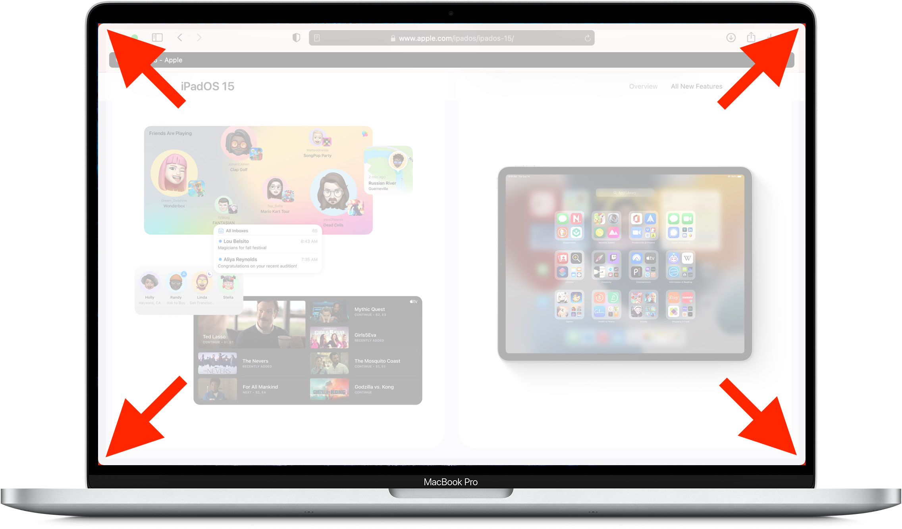
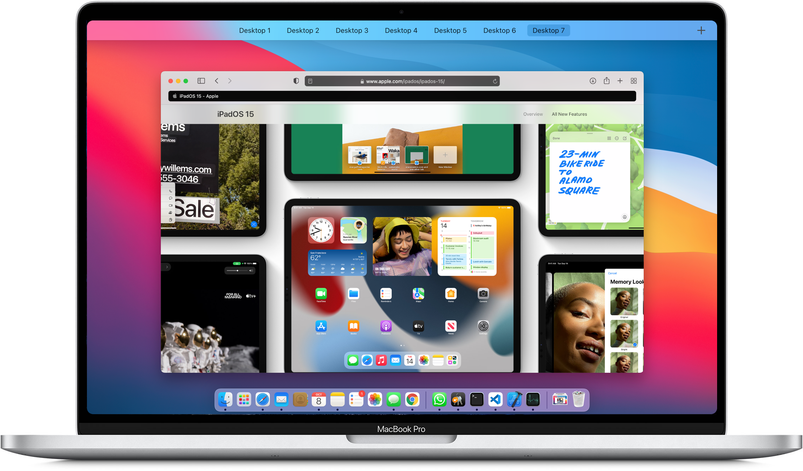

# MacOS Rounded Screen Corners

This app makes the corners of the MacOS screen round instead of the default boxy look. 
Rounded corners are more consistent with the shape of the windows of the new MacOS design. 
Also, MacOS reveals the desktop background through gaps between the window corners and the screen corners on all four sides even if the window is fully maximized and the menu bar and the dock is hidden. 
This can be distracting to some people
(This issue happens in window zoom mode where you get by clicking the green window button while pressing Option key. Not in fullscreen window mode where you get a dedicated mission control space for a single window).
See the screenshot below. Rounded corners fixes this issue as well.

## Default Boxy Screen Corners

See the corners of the screen. The red color desktop is visible through the gaps between the corners of the screen and the corners of the maximized window since the screen is boxy and the window is rounded.

## Rounded Screen Corners

Rounded screen corners fixes the above issue and also gives a look that is more consistent with the rest of the MacOS user interface design.

Following is a screenshot of a maximized window with rounded screen corners.

Following is a screenshot of MacOS mission control with rounded screen corners.

## How to Use the Tool

You can clone the repository and build the app by yourself if you have Xcode installed in your machine. If not, you can [download a compiled version of this tool here](https://samiyuru.com/static/posts/macos-rounded-corners/MacOS%20Rounded%20Screen.app.zip). Unzip the app, copy it to the Applications directory and simply run the app by double clicking on it. Add the app to your login items to start the app if you want to automatically start the app when your computer starts. Check [this document](https://support.apple.com/guide/mac-help/open-items-automatically-when-you-log-in-mh15189/mac) to learn how to add the app to login items.
